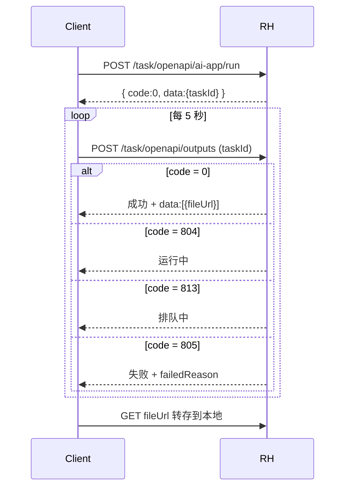

# RunningHub API 调用参考（rh.md）

> 本地落地版本，整理自 RunningHub 官方文档（<https://www.runninghub.cn/runninghub-api-doc-cn/>）
> 与父项目 `e:\PenguinPravite\backend-nodejs\src\routes\runninghub.js` / `e:\PenguinPravite\gpt-image-2-web\index.html` 实战实现。
>
> 用于本工程后续 `RunningHubNode` / `RhConfigNode` / `proxy.js` 改造的唯一权威依据。

---

## 0 · 全局约定

| 项 | 值 |
|---|---|
| Base URL | `https://www.runninghub.cn` |
| Host Header | `www.runninghub.cn`（必须加，否则部分接口 403） |
| Content-Type | `application/json`（除上传接口为 `multipart/form-data`） |
| 鉴权 | `apiKey` 字符串放在 **请求 body** 里（不是 header）。AI 应用接口同时支持 `Authorization: Bearer <apiKey>` |
| 任务模式 | `taskType: 'ASYNC'` 强烈推荐（同步会阻塞 ≥30 秒） |

业务侧两种 API Key：
- **会员消费 Key**（"App Key"）：发起 AI 应用任务、ComfyUI 任务、上传文件用 → `runningHubAppApiKey`
- **企业共享 Key**（"Magic Key"）：标准模型 API、`/openapi/v2/media/upload/binary` 用 → `runningHubMagicApiKey`

> ⚠️ T8-penguin-canvas 当前合并为单一 `rhApiKey`；如未来要解锁标准模型 API，再拆双 Key。

---

## 1 · AI 应用任务（最常用）

### 1.1 发起任务 `POST /task/openapi/ai-app/run`

**请求**
```json
{
  "apiKey": "sk-xxxxx",
  "webappId": "1234567890",
  "nodeInfoList": [
    { "nodeId": "9", "fieldName": "file",   "fieldValue": "abc123.mp4" },
    { "nodeId": "3", "fieldName": "prompt", "fieldValue": "一只猫" },
    { "nodeId": "1", "fieldName": "resolution", "fieldValue": "1k" }
  ],
  "taskType": "ASYNC",
  "instanceType": "plus",
  "webhookUrl": "https://your.webhook/notify"
}
```

| 字段 | 类型 | 必填 | 说明 |
|---|---|---|---|
| `apiKey` | string | ✓ | 会员消费 Key |
| `webappId` | string | ✓ | AI 应用 ID（控制台获取） |
| `nodeInfoList` | array | ✓ | 节点参数注入；空数组用模板默认值 |
| `taskType` | string | ✗ | `ASYNC`（默认）/`SYNC` |
| `instanceType` | string | ✗ | `default` / `plus` / `pro`（影响算力） |
| `webhookUrl` | string | ✗ | 任务完成后 RH 回调通知 |

**`nodeInfoList` 字段三件套**
- `nodeId`：ComfyUI 节点序号（在 RH 控制台右上角"获取节点ID"复制）
- `fieldName`：该节点上要被覆盖的输入字段名（如 `prompt` / `image` / `file` / `video` / `width` / `seed`）
- `fieldValue`：值——**当 fieldName 是文件类（image / video / audio / file）时，必须是先调用上传接口拿到的 `fileName`，不能是 URL/本地路径**

**响应（成功）**
```json
{
  "code": 0,
  "msg": "success",
  "data": { "taskId": "1773800089715015682" }
}
```

**错误码**
| code | 含义 |
|---|---|
| 0 | 成功 |
| 421 | 参数缺失/格式错误 |
| 433 | API Key 无效 |
| 434 | webappId 不存在 |
| 435 | 余额不足 |
| 803 | 队列已满 |
| 805 | 任务失败 |

### 1.2 查询任务输出 `POST /task/openapi/outputs`
```json
{ "apiKey": "sk-xxxxx", "taskId": "1773800089715015682" }
```

**响应**
```jsonc
{
  "code": 0,        // 0=成功 / 804=运行中 / 813=排队中 / 805=失败
  "msg": "success",
  "data": [
    {
      "fileUrl": "https://rh-images.xiaoyaoyou.com/xxx.png",
      "fileType": "image",
      "taskCostTime": "12000"
    }
  ]
}
```

> 注意：`data` 也偶有返回成 `{outputs:[...]}` 或 `{fileUrl,fileType}` 单对象的情况（不同应用）；后端代理需做兼容。

---

## 2 · 上传文件（图/视频/音频）

### 2.1 AI 应用专用上传 `POST /task/openapi/upload`

**FormData**
```
apiKey:     sk-xxxxx
fileType:   input
file:       <二进制>
```

**响应**
```json
{
  "code": 0,
  "data": { "fileName": "abc123-xyz.png", "fileType": "IMAGE" }
}
```

后续在 `nodeInfoList[*].fieldValue` 直接填这个 `fileName`，对应节点（如 `LoadImage` / `LoadVideo` / `LoadAudio`）会自动拉取。

支持类型：jpg / jpeg / png / webp / gif / mp4 / webm / mov / mp3 / wav / zip
单文件上限：约 50MB（视频可放宽到 100MB）

### 2.2 标准模型 API 上传 `POST /openapi/v2/media/upload/binary`
> 仅当走 reference-to-image / reference-to-video 等标准模型 API 时才用，AI 应用工作流不需要。

**Header**：`Authorization: Bearer <magicApiKey>`
**FormData**：`file: <二进制>`
**响应**：`{ data: { download_url: "https://...", type: "image" } }`

返回的 `download_url` 直接作为标准模型 API 入参的图片 URL。

### 2.3 Lora 上传（特殊三步）
1. `POST /task/openapi/lora/upload-url-get` 拿临时上传 URL
2. PUT 上传 lora 文件到该 URL
3. nodeInfoList 中 `RHLoraLoader` 节点的 `lora_name` 填回返回的文件名

---

## 3 · ComfyUI 工作流任务

### 3.1 简易发起 `POST /task/openapi/create`
直接传完整 workflow JSON：
```json
{
  "apiKey": "sk-xxxxx",
  "workflowId": "12345",
  "nodeInfoList": [...],
  "addMetadata": true
}
```

### 3.2 高级发起 `POST /task/openapi/comfy/run`
```json
{
  "apiKey": "sk-xxxxx",
  "workflow": { /* 完整 workflow.json */ },
  "addMetadata": true,
  "instanceType": "plus"
}
```

### 3.3 取消任务 `POST /task/openapi/cancel`
```json
{ "apiKey": "sk-xxxxx", "taskId": "..." }
```

---

## 4 · 辅助查询接口

### 4.1 获取 AI 应用调用示例 `GET /api/webapp/apiCallDemo`
```
GET /api/webapp/apiCallDemo?apiKey=sk-xxxxx&webappId=1234567890
```
返回 `{ data: { appName, nodeInfoList: [{nodeId, fieldName, description, ...}], coverUrl } }`，
**用于在 UI 上展示该应用支持哪些节点参数注入**——RhConfigNode 智能补全的数据源。

### 4.2 获取公共模型列表 `POST /task/openapi/get-model-list`
```json
{ "apiKey": "sk-xxxxx", "modelType": "checkpoint" }
```

### 4.3 获取账户信息 `GET /api/account/get-account-info?apiKey=...`

---

## 5 · 任务状态轮询完整流程



推荐参数：`POLL_INTERVAL = 5000ms`，`MAX_ATTEMPTS = 480`（合计 40 分钟超时）。

---

## 6 · T8-penguin-canvas 后端代理实现现状

### 6.1 已实现路由（`backend/src/routes/proxy.js`）
| 方法 | 路径 | 用途 |
|---|---|---|
| POST | `/api/proxy/runninghub/submit` | 转 `/task/openapi/ai-app/run` |
| GET | `/api/proxy/runninghub/query?taskId=...` | 转 `/task/openapi/outputs`，并把 fileUrl 转存到本地 `/files/output/`；多结构容错（`data:[]` / `{outputs}` / `{results}` / `{files}` / 单对象） |
| GET | `/api/proxy/runninghub/app-info?webappId=...` | 转 `/api/webapp/apiCallDemo` |
| POST | `/api/proxy/runninghub/upload-asset` | body: `{url}`；后端拉 url（本地 `/files/output/*` 或远程 https）→ multipart（`apiKey/fileType=input/file`）转发 `/task/openapi/upload` → 返回 `{fileName, fileType}`。用于 RhConfigNode 媒体参数提交前的 url→fileName 转换 |

### 6.2 设置字段对齐（已修复）
- `settings.rhApiKey`（前端 ApiSettings + 后端 settings.js + proxy.js 三方一致；**历史误写 `runninghubApiKey` 已纠正**）

---

## 7 · 通用素材接入策略（RhConfigNode 阶段 B 已落地）

### 7.1 NodeInfo 条目字段升级
```ts
interface NodeInfoEntry {
  nodeId: string;                                   // RH 工作流节点 ID
  fieldName: string;                                // 字段名（prompt / image / file / …）
  fieldValue: string;                               // text/number: 直填；image/video/audio: url（提交时转 fileName）或已是 fileName
  valueType?: 'text' | 'number' | 'image' | 'video' | 'audio';
  sourceFromUpstream?: boolean;                     // 勾选后：从上游节点自动同步对应 kind 的 url
}
```

### 7.2 提交前预处理（RunningHubNode.resolveNodeInfoList）
```ts
// 位于 RunningHubNode.tsx。handleRun 提交前调用。
async function resolveNodeInfoList(raw: any[]) {
  const out = [];
  for (const it of raw) {
    let v = it.fieldValue;
    if (['image','video','audio'].includes(it.valueType)) {
      if (!v) continue;                              // 未提供资源跳过
      if (/^https?:\/\//i.test(v) || v.startsWith('/files/output/') || v.startsWith('/output/')) {
        const r = await uploadRhAsset(v);            // 调 /upload-asset
        v = r.fileName;
      }
    } else if (it.valueType === 'number') {
      const num = Number(v);
      if (Number.isFinite(num)) v = num;
    }
    out.push({ nodeId: it.nodeId, fieldName: it.fieldName, fieldValue: v });
  }
  return out;
}
```

### 7.3 RhConfigNode 上游接入
- 左侧单个 `target` Handle（同 id）接受任意产出 url 的节点（image / video / audio / output / upload 等）
- 每条目带 `valueType` 下拉；image/video/audio 可勾选「从上游自动获取」
- 启用后 RhConfigNode 会 `useEffect` 扫描上游节点，从 `imageUrl/imageUrls[]/urls[]/generatedImages[]/videoUrl/audioUrl/uploadType+url` 中提取对应 kind 第一个可用 url填入 fieldValue（readOnly）
- 预览：fieldValue 是图片扩展名时在节点内可视预览

---

## 8 · 测试快查

```bash
# 1. 上传图片
curl -X POST https://www.runninghub.cn/task/openapi/upload \
  -H "Host: www.runninghub.cn" \
  -F "apiKey=sk-xxx" -F "fileType=input" -F "file=@./cat.png"
# → { code:0, data:{ fileName:"abc123.png", fileType:"IMAGE" } }

# 2. 发起任务
curl -X POST https://www.runninghub.cn/task/openapi/ai-app/run \
  -H "Host: www.runninghub.cn" -H "Content-Type: application/json" \
  -H "Authorization: Bearer sk-xxx" \
  -d '{"apiKey":"sk-xxx","webappId":"1234567890","nodeInfoList":[{"nodeId":"2","fieldName":"image","fieldValue":"abc123.png"}],"taskType":"ASYNC","instanceType":"plus"}'
# → { code:0, data:{ taskId:"1773..." } }

# 3. 轮询输出
curl -X POST https://www.runninghub.cn/task/openapi/outputs \
  -H "Host: www.runninghub.cn" -H "Content-Type: application/json" \
  -d '{"apiKey":"sk-xxx","taskId":"1773..."}'
# → { code:0, data:[{ fileUrl:"https://...", fileType:"image" }] }
```

---

## 9 · 错误码总表

| code | 类别 | 说明 | 常见处置 |
|---|---|---|---|
| 0 | 成功 | OK | — |
| 421 | 参数 | 必填字段缺失 / nodeId 不存在 | 检查 nodeInfoList |
| 433 | 鉴权 | apiKey 无效 / 过期 | 控制台重新生成 |
| 434 | 资源 | webappId 不存在 / 已下架 | 确认 ID |
| 435 | 余额 | 余额不足 | 充值 |
| 803 | 队列 | 排队队列已满 | 稍后重试 |
| 804 | 进行中 | 任务运行中 | 继续轮询 |
| 805 | 失败 | 任务执行失败 | 查 `failedReason` |
| 813 | 排队 | 任务排队中 | 继续轮询 |

---

## 10 · 参考实现速查

- 父项目后端：`e:\PenguinPravite\backend-nodejs\src\routes\runninghub.js` —— 完整 11 个路由
- 父项目前端样例：`e:\PenguinPravite\components\RunningHubGenerator.tsx` —— nodeInfoList 动态构造（含文件上传后回填 fileName）
- 父项目工作流前端：`e:\PenguinPravite\gpt-image-2-web\index.html` line 8695-8850 —— ASYNC 提交 + 5s 轮询完整 demo

---

> 文档版本：v1（2026-05-23 与 phase24 一同落地）
> 后续 nodeInfoList schema 自动获取（4.1 接口）+ Lora 三步上传如需启用，新增 §11/§12 章节即可。
